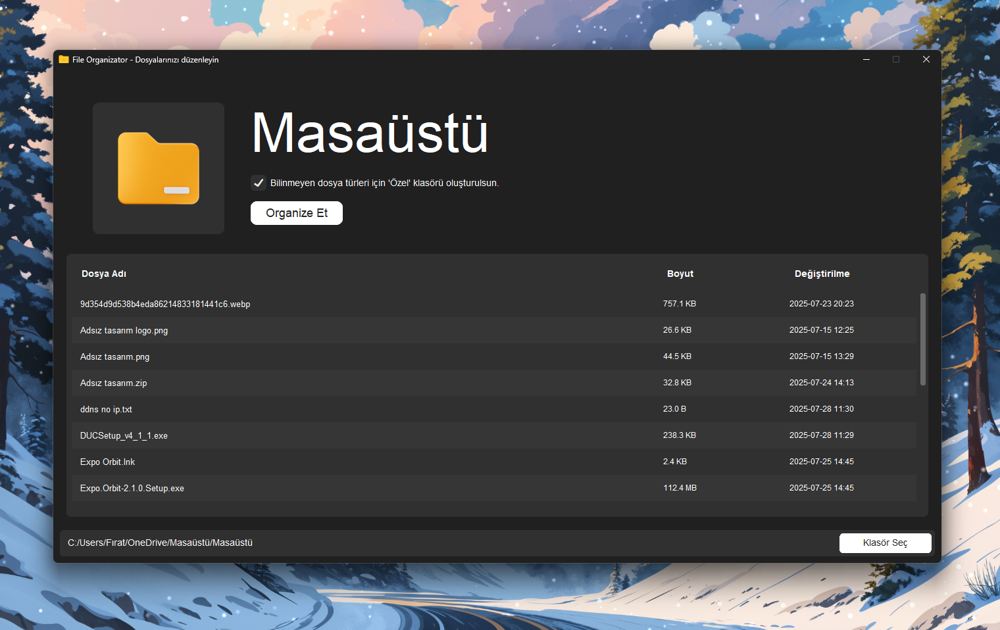

<div align="center">

# 📂 File Organizator

**Smart & Modern File Organizer with Python GUI**

*Select a folder, organize your files, and boost your productivity in seconds.*


[](https://github.com/firatmio/file-organizator)
[](https://github.com/firatmio/file-organizator)
[](https://github.com/firatmio/file-organizator)

</div>

---

## 📖 Overview

**File Organizator** is a lightweight **Python desktop application** that helps you automatically **sort and organize files** in a selected folder.  
It groups files by type (images, videos, documents, music, compressed files, etc.) into dedicated subfolders for a cleaner and more productive workspace.

The app features a **modern GUI built with CustomTkinter**, making file organization simple and visually intuitive.

---

## ✨ Features

- 🎨 **Modern GUI** with [CustomTkinter](https://github.com/TomSchimansky/CustomTkinter)
- 📂 **Auto-classify files** into categories (Images, Videos, Documents, Audio, Software, etc.)
- 🗂️ **Optional "Özel" folder** for unknown file types
- ⚡ **Fast & reliable** file handling
- 🖥️ **Cross-platform support** (Windows, Linux, macOS)
- 🔍 Built-in file explorer integration (open files/folders directly)
- 🛡️ Safe: Skips missing/corrupted files gracefully

---

## 🚀 Quick Start

### 1. Clone the Repository

```bash
git clone https://github.com/firatmio/file-organizator.git
cd file-organizator
```

### 2. Install Requirements

```bash
pip install -r requirements.txt
```

**requirements.txt**

```txt
customtkinter
Pillow
```

### 3. Run the App

```bash
python main.py
```

---

## 🖼️ Screenshots

> *Example UI after selecting a folder:*

<p align="center">
  
</p>

---

## ⚙️ How It Works

1. Launch the app and **select a folder**.
2. Preview all files with details (name, size, last modified date).
3. Click **Organize Et** to automatically sort files:
   - Images → `Resim/`
   - Videos → `Video/`
   - Documents → `Doküman/`
   - Audio → `Ses/`
   - Applications → `Uygulama/`
   - Code → `Yazılım/`
   - Compressed → `Sıkıştırılmış/`
   - Databases → `Veritabanı/`
   - Fonts → `Font/`
   - Unknown types → `Özel/` (if enabled)
4. Files are moved into categorized subfolders inside the selected folder.

---

## 🛠️ Tech Stack

- **Language**: Python 3.10+
- **GUI Framework**: CustomTkinter + Tkinter
- **Image Handling**: Pillow (PIL)
- **OS Integration**: `os`, `subprocess`, `shutil`

---

## 🤝 Contribution

Contributions are welcome! 🚀

1. Fork the repo
2. Create your branch (`git checkout -b feature/amazing-feature`)
3. Commit changes (`git commit -m 'Add amazing feature'`)
4. Push branch (`git push origin feature/amazing-feature`)
5. Open a Pull Request

---

## 📄 License

Apache 2.0 - see [LICENSE](LICENSE) for details.

---

## 🏷️ Version History

- **v0.1.0** – First beta release  
  - Modern GUI with CustomTkinter  
  - Auto file classification  
  - Special folder support  

---

<div align="center">

**⭐ If you find this project useful, don’t forget to star it!**  
**Created with ❤️ by [Fırat Tuna Arslan](https://github.com/firatmio)**

</div>
